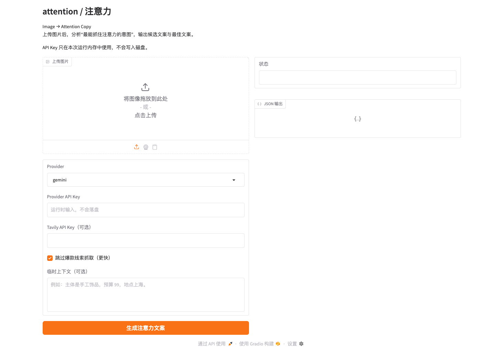

# attention / 注意力

**Find the most attention-grabbing angle in an image, then turn it into usable copy.**  
上传一张图，帮你找出最抓人的点，再给你一版能直接改的文案草稿。



## 它能帮你做什么

- 先帮你找重点：图里最该写的点，往往不是整张图，而是一个细节。
- 再给你文案草稿：标题、正文、标签一次给到，方便你继续改。
- 尽量不乱编：你没提供的信息，它不会硬写。

## 30 秒上手 | Quick Start

```bash
python3 -m pip install -r requirements.txt
python3 app.py --inbrowser
```

打开 Gradio 页面后：
- 上传图片
- 选择 `provider`（`gemini` / `minimax` / `auto`）
- 输入你自己的 API key（只在这次运行里用，不会写进文件）
- 点击 `开始生成`
- 或点击 `查看示例结果`

## 个人怎么用 | For Individuals

- 电脑上直接用：`python3 app.py --inbrowser`
- 手机上用：`python3 app.py --host 0.0.0.0` 后，用手机打开 `http://你的局域网IP:7860`
- 想批量跑图片：`attention-cli`
- 详细说明：[docs/for-individuals.md](./docs/for-individuals.md)

## 安装为包 | Install as a Package

```bash
python3 -m pip install -e .
```

可执行入口：
- `attention-cli`
- `attention-api`
- `attention-mcp`

## CLI 用法 | CLI Usage

```bash
attention-cli --help
attention-cli --provider gemini --api-key "$GEMINI_API_KEY" --skip-viral-research
```

默认路径约定：
- 输入图片：`photos/`
- 可选上下文：`context/context_YYYYMMDD.json`
- 输出结果：`output/attention_YYYYMMDD.json`
- 输出摘要：`output/attention_YYYYMMDD.md`

## 开发者接入 | Developer Interfaces

### HTTP API

```bash
attention-api --host 127.0.0.1 --port 8000
```

- `POST /v1/intent/analyze`
- `POST /v1/copy/generate`

文档：
- [docs/http-api.md](./docs/http-api.md)
- [docs/integration.md](./docs/integration.md)

### MCP

```bash
attention-mcp
```

公开工具：
- `analyze_image_intent`
- `generate_attention_copy`

文档：
- [docs/mcp.md](./docs/mcp.md)

### Skill

仓库内包含可分发 skill：
- [skills/attention-mcp/SKILL.md](./skills/attention-mcp/SKILL.md)

说明：
- [docs/skill.md](./docs/skill.md)
- [docs/for-developers.md](./docs/for-developers.md)

## 输出给你的是什么

- 图里最吸引人的点
- 看到图的人最可能会问的一句话
- 一版可以直接继续改的中文文案

## 示例结果拆解

公开示例顺序固定为：

1. 原图：局部细节穿搭照，第一眼会先停在无名指上的蜘蛛装饰。
2. 视觉主角：`蜘蛛装饰美甲`
3. 用户最想问：`这个蜘蛛装饰美甲是怎么做出来的？`
4. 为什么这个角度成立：不是泛泛写整套穿搭，而是先用一个反差细节把人停住。
5. 生成文案：把“先被细节吸走，再顺着气氛看完整张图”的过程写出来，形成更自然的图文展开。

## 输出契约 | Output Contract

统一 schema：`attention.v1`

公开响应至少包含：
- `status`
- `intent`
- `copy_candidates`
- `best_copy`
- `why_it_works`
- `meta`

示例文件：
- `examples/attention_sample.json`
- `examples/attention_sample.md`
- `examples/requests/analyze_path.json`
- `examples/requests/analyze_base64.template.json`
- `examples/requests/generate_copy.json`
- `scripts/encode_image.py`
- `scripts/http_demo.py`

## 安全与隐私 | Security

- 仓库只提供 `config.example.json` 模板。
- `config.json`、真实图片、日志、运行产物默认不会进入 Git。
- UI、HTTP API、MCP 中输入的 key 只在当前请求内存中使用，不会自动写入文件。
- 如果视觉分析失败，程序会明确报错，不会输出伪造成功结果。
- 公开模式默认 `BYOK`。

## FAQ

**它和普通 AI 文案工具有什么区别？**  
它不是上来就硬写一段话，而是先帮你看图，找到最值得写的那个点，再出文案。

**适合什么内容？**  
适合日常发图、穿搭、美甲、饰品、探店、局部细节这类内容。

**它不是做什么的？**  
它不会自动发内容，也不会保证爆款；它做的是帮你更快找到切入点。

**它能被第三方接入吗？**  
可以。仓库现在提供了 CLI、HTTP API、基础 `stdio MCP` 和可分发 skill，适合前端、插件、工作流系统和 Agent 使用。

## Browser Demo

仓库附带一个最小浏览器插件示例：
- [extensions/chrome/README.md](./extensions/chrome/README.md)

## Tests

```bash
python3 -m unittest discover -s tests -v
```

## Scope (v1)

- 保留：图片意图分析 + 文案生成核心链路 + Gradio 演示 + HTTP API + 基础 MCP + Skill
- 不包含：自动发布、评论监控、养号、变现等运营模块
